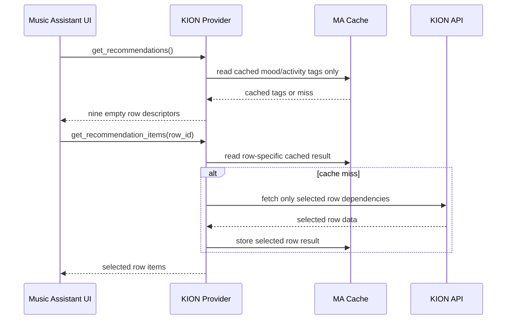

## Problem Statement

Ten automated reverse-sync drafts for upstream Music Assistant changes overlap,
several contain unresolved conflict markers, and three make no effective provider
change. As a result, KION Music still eagerly loads every recommendation row,
keeps authentication controls in provider options, and does not consistently
share concurrent playlist fetches according to the final upstream cache contract.

## Solution Summary

Port the final combined behavior of upstream PRs 4793, 4487, 4946, 4948, 5017,
5053, 5058, 5370, 5430, and 5464 onto a fresh `dev` base. Recommendation rows
become descriptor-first and load independently, OAuth token ownership moves to
the interactive setup flow, and regular, liked, and My Mix playlists receive
separate cached helpers with final single-flight sharing semantics.

## Acceptance Criteria

1. Recommendation descriptors return nine ordered rows without KION backend
   calls.
2. Loading one recommendation row invokes only that row's backend dependencies.
3. Setup owns the OAuth token; provider options contain only playback and
   transport settings.
4. Three concurrent requests for one regular playlist perform one backend fetch.
5. Three concurrent My Mix requests perform one backend fetch and one rotor
   advance.
6. Failed or cancelled shared fetches are not stored as successful cache values.
7. Pagination after the provider's first playlist page terminates without a
   backend fetch.
8. Mood and activity titles remain stable while a warm cached tag list supplies
   an hourly deterministic subtitle matching the subsequently loaded items.
9. Existing configured instances obtain their token through the Music Assistant
   setup-value compatibility contract.
10. The full repository verification suite is green against current Music
    Assistant `dev`.

## Test Plan

- `test_get_recommendations_returns_static_rows_without_backend_calls` pins row
  order, empty descriptors, and zero KION client awaits.
- The recommendation-row parameterization checks that every item ID calls only
  its documented KION sources and that unknown IDs return an empty collection.
- Warm- and cold-cache recommendation tests pin deterministic subtitles without
  descriptor-time backend traffic.
- Setup-flow tests submit an OAuth token, reproduce a translated login failure,
  retry with a new token, and verify that neither error output nor options expose
  the secret.
- Provider options tests retain quality, My Mix limit, liked-track limit,
  transport, codec, and base-URL settings while rejecting auth actions.
- Three gated concurrent callers test one regular playlist fetch and one My Mix
  fetch; failure and cancellation cases verify that unsuccessful work does not
  poison the cache.
- Parser snapshots pin the current `audio_metadata` model serialization.
- The complete pytest, Ruff, mypy, method-order, and pre-commit gates provide
  repository-wide regression coverage.

## Sequence Diagram

## Data Model

| Data | Owner | Storage | Lifecycle | Change |
| --- | --- | --- | --- | --- |
| OAuth token | Setup flow | Provider setup data | Collected and validated during setup; read through `get_setup_value` | Moves out of provider options |
| Audio quality | Provider options | Provider config | Editable after setup | Unchanged |
| My Mix track limit | Provider options | Provider config | Editable after setup | Unchanged |
| Liked-track limit | Provider options | Provider config | Editable after setup | Unchanged |
| Transport and codecs | Provider options | Provider config | Editable after setup | Unchanged |
| API base URL | Provider options | Provider config | Editable after setup | Unchanged |
| Recommendation row descriptor | Provider | Computed per request | Contains identity and display metadata, never eager items | Split from row items |
| Recommendation row items | Provider/cache | Row-specific cache entry | Loaded only for the requested row | New two-method contract |
| Playlist tracks | Provider/cache | Separate regular, liked, and My Mix cache keys | Three-hour lifetime with expired-cache fallback and shared misses | Cache moves from dispatcher to helpers |

## Upstream Mapping

| Upstream PR | Consolidated behavior |
| --- | --- |
| 4793 | Current parser/model snapshot serialization |
| 4487 | Descriptor-first recommendation interface |
| 4946, 4948 | Static labels, cache-only subtitles, unload and method-order follow-ups |
| 5017, 5053, 5058 | Setup flow, provider options migration, translated login failure |
| 5370, 5430, 5464 | Final split-cache and unconditional single-flight behavior |

## Verification Evidence

Verified on 2026-08-11 against Music Assistant `dev` commit
`a91504084610a817212c17174662cf73a4829bd9` and
`music-assistant-models==1.1.185`:

- Focused parser, recommendation, setup, config, provider, and streaming suites:
  58 passed, including 7 snapshot assertions.
- Full pytest suite: 77 passed, including 7 snapshot assertions.
- Ruff formatting: 16 files already formatted.
- Ruff lint: all checks passed for `provider/` and `tests/`.
- Mypy: no issues in 16 source files. Its cache was placed on `/mnt/data`
  because the `/tmp` filesystem had insufficient free space; no repository
  configuration changed.
- Method-order checker: passed.
- `pre-commit run --all-files`: all 16 hooks passed.
- Merge-marker scan and `git diff --check`: no findings.
- `VERSION`, `CHANGELOG.md`, `uv.lock`, and `pyproject.toml`: unchanged.
